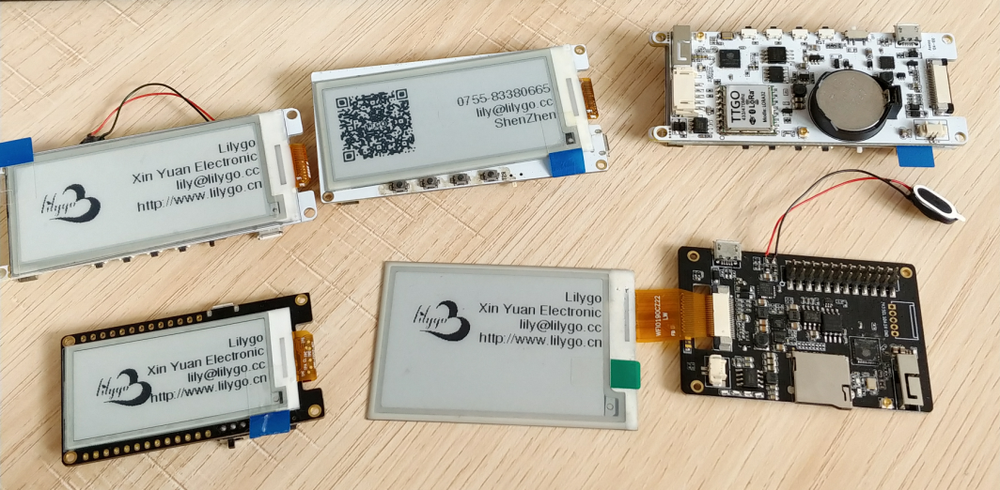
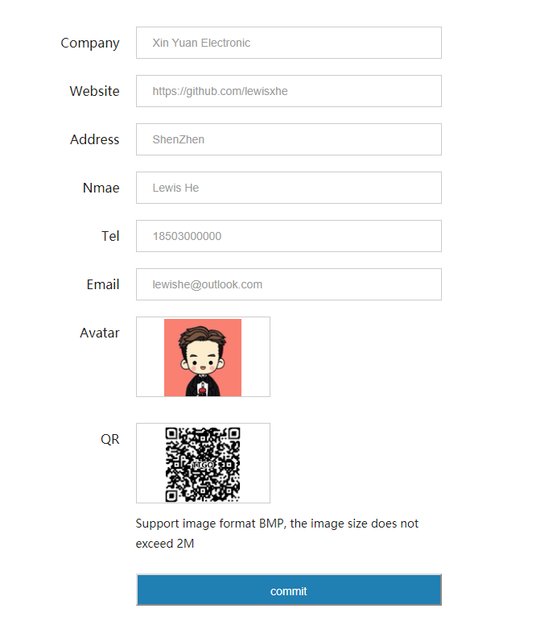
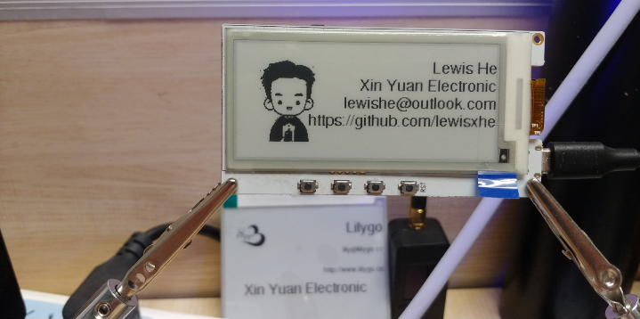

 <h1 align = "center">Esp badge </h1>

# Use Arduino IDE
1. Install the correct serial port driver [CP210X Driver](https://www.silabs.com/products/development-tools/software/usb-to-uart-bridge-vcp-drivers)
2. For the first use, you need to select the model you are using at the top of `board_def.h`, and select the corresponding screen header file 
3. Change `src/main.cpp` to `src.ino`
4. Copy the files in the `lib` directory to `~/Arduino/libraries`,
Windows users copy to `Documents/Arduino/libraries`
4. Double-click to open `src/src.ino` 
5. Change the port to the correct port and select upload
6. Use `Arduino` ESP32 Sketch data Upload files,if you not install,[Download ESP32FS-vX.zip](https://github.com/me-no-dev/arduino-esp32fs-plugin/releases),Extract to <C:\Users\Your User Name\Documents\Arduino\tools>,Open `Ardunio IDE`,  `Tools -> ESP32 Sketch data Upload -> Upload`
   

# Use PlatformIO
1. Install the correct serial port driver [CP210X Driver](https://www.silabs.com/products/development-tools/software/usb-to-uart-bridge-vcp-drivers)
2. For the first use, you need to select the model you are using at the top of `board_def.h`, and select the corresponding screen header file 
3. Open directly to change your serial port in `platformio.ini`, click compile
4. Terminal run `platformio.exe run --target uploadfs` to upload the FS file to ESP32 

## Library link used :
- [Fork branch/lewisxhe/GxEPD](https://github.com/lewisxhe/GxEPD)
- [Adafruit-GFX-Library](https://github.com/adafruit/Adafruit-GFX-Library)
- [AsyncTCP](https://github.com/me-no-dev/AsyncTCP)
- [ESPAsyncWebServer](https://github.com/me-no-dev/ESPAsyncWebServer)
- [AceButton](https://github.com/bxparks/AceButton)

## Configure Badge Website

- **Configure the badge by entering http://ttgo.local or ip address in your browser.**

- **The display will be refreshed after submission**
- **Page1**

- **Page2**

## CAUTION:
- Currently only supports 100*100 size BMP format as image file for uploading

